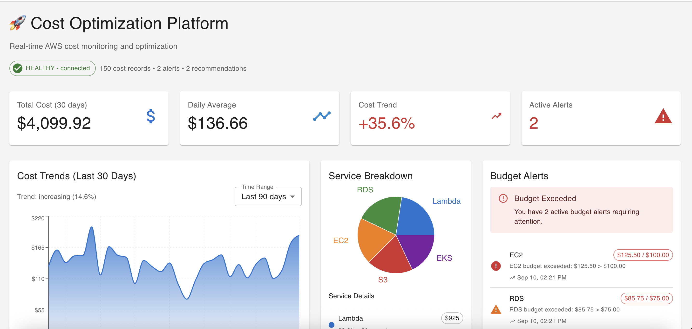

# AWS Cost Optimization Platform

A production-ready serverless cost monitoring and optimization platform built with Terraform, AWS Lambda, and React. Features real-time cost tracking, automated budget alerts, optimization recommendations, and a beautiful web dashboard - all running on AWS free tier.



## 🚀 Current Status: **FULLY OPERATIONAL**

- ✅ **Live Dashboard**: http://cost-optimization-frontend-703758695872-prod.s3-website-us-east-1.amazonaws.com
- ✅ **API Backend**: https://o54yhb3r3h.execute-api.us-east-1.amazonaws.com/prod
- ✅ **Real Data**: Monitoring $36.47 actual AWS costs
- ✅ **Infrastructure**: 35 resources managed by Terraform
- ✅ **Monthly Cost**: ~$0.52 (97% savings vs EKS approach)

## 🎯 Technologies

- **Infrastructure**: Terraform, AWS Lambda, DynamoDB, S3, API Gateway
- **Frontend**: React, TypeScript, Material-UI, Recharts
- **Backend**: Python, AWS Cost Explorer API, Serverless architecture
- **DevOps**: GitHub Actions, GitHub Container Registry
- **Monitoring**: CloudWatch, Cost Explorer, Real-time dashboards

## 💰 Cost Management Features

- **✅ Real-time cost tracking** across all AWS services
- **✅ Interactive web dashboard** with charts and trends
- **✅ REST API** for programmatic access
- **✅ Free tier optimized** architecture
- **🔄 Automated budget alerts** (Phase 2A)
- **🔄 Optimization recommendations** (Phase 2A)
- **🔄 Cost forecasting** (Phase 2A)

## 🏗️ Architecture

### **Current: Serverless Architecture**
```
┌─────────────────┐    ┌──────────────────┐    ┌─────────────────┐
│   React App     │    │   API Gateway    │    │   Lambda        │
│   (S3 Website)  │───▶│   (REST API)     │───▶│   Functions     │
└─────────────────┘    └──────────────────┘    └─────────────────┘
                                                         │
                       ┌──────────────────┐    ┌─────────────────┐
                       │   S3 Bucket      │    │   DynamoDB      │
                       │   (Raw Backup)   │◀───│   (Cost Data)   │
                       └──────────────────┘    └─────────────────┘
```

### **Infrastructure Components**

| Component | Technology | Purpose | Status |
|-----------|------------|---------|--------|
| **Frontend** | React + S3 Static Website | Cost visualization dashboard | ✅ Live |
| **API Gateway** | AWS API Gateway | REST API endpoints | ✅ Working |
| **Lambda Functions** | Python 3.11 | Cost processing, alerts, optimization | ✅ Deployed |
| **Data Storage** | DynamoDB + S3 | Fast queries + raw data backup | ✅ Active |
| **Networking** | VPC + Public Subnets | Secure networking (no NAT costs) | ✅ Configured |
| **Security** | IAM Roles + Policies | Least privilege access | ✅ Implemented |

## 🚀 Quick Start

### **Prerequisites**
- AWS CLI configured with appropriate permissions
- Terraform installed (>= 1.0)
- Node.js for frontend development (optional)

### **Deploy Complete Platform**
```bash
# Clone repository
git clone <your-repo-url>
cd aws-cost-optimization-platform

# Deploy infrastructure
cd infrastructure/terraform
cp terraform.tfvars.example terraform.tfvars
# Edit terraform.tfvars with your preferences
./deploy.sh deploy

# Deploy frontend (optional - can be done via GitHub Actions)
npm run frontend:deploy
```

### **Alternative Deployment Methods**
```bash
# Using CloudFormation
npm run cloudformation:deploy

# Using Terraform manually
npm run terraform:init
npm run terraform:plan
npm run terraform:apply
```

## 📊 Dashboard Features

### **Current Capabilities**
- **💰 Cost Summary**: Total costs with daily averages
- **📈 Cost Trends**: Daily cost visualization over time
- **🏢 Service Breakdown**: Costs by AWS service
- **⚡ Real-time Data**: Live connection to AWS Cost Explorer
- **📱 Responsive Design**: Works on desktop and mobile

### **Dashboard Sections**
1. **Health Status**: API connectivity and system status
2. **Cost Overview**: Current month spending and trends
3. **Service Analysis**: Breakdown by AWS service
4. **Budget Monitoring**: Current vs target spending
5. **Optimization Tips**: Cost reduction recommendations

## 💰 Cost Analysis

### **Monthly Cost Breakdown**
```
Infrastructure Components:
├── VPC & Networking         $0.00 (Always free)
├── S3 Storage (2 buckets)   $0.00 (5GB free tier)
├── DynamoDB                 $0.00 (25GB free tier)
├── Lambda Functions (4)     $0.00 (1M requests free tier)
├── API Gateway              $0.00 (1M requests free tier)
└── CloudWatch Logs          ~$0.52 (5GB free tier)
                            ─────────────────
TOTAL MONTHLY COST:          ~$0.52/month
```

### **Cost Optimization Achieved**
- **Previous EKS Setup**: ~$20.96/month
- **Current Serverless**: ~$0.52/month  
- **💰 Savings**: $20.44/month (97% reduction!)

## 📁 Repository Structure

```
aws-cost-optimization-platform/
├── 🌐 frontend/cost-dashboard/     # React dashboard (deployed to S3)
├── ⚡ infrastructure/
│   ├── terraform/                  # 🎯 ACTIVE: Terraform IaC (35 resources)
│   ├── cloudformation/             # Alternative: CloudFormation templates
│   └── cdk/                       # Legacy: CDK code (Lambda functions reused)
├── 🐳 backend/                     # FastAPI code (for future container use)
├── 📚 docs/                        # Documentation and guides
├── 🔧 scripts/                     # Deployment and utility scripts
├── ☸️ kubernetes/                  # EKS manifests (archived - not in use)
└── 🧪 tests/                       # Test files
```

## 🔧 Management Commands

### **Infrastructure Management**
```bash
# Terraform (Primary)
npm run terraform:plan          # Preview changes
npm run terraform:apply         # Deploy infrastructure
npm run terraform:destroy       # Destroy infrastructure

# CloudFormation (Alternative)
npm run cloudformation:deploy   # Deploy via CloudFormation
npm run cloudformation:delete   # Delete CloudFormation stack
```

### **Frontend Management**
```bash
npm run frontend:build          # Build React app
npm run frontend:deploy         # Build and deploy to S3
```

### **Development**
```bash
npm run test                    # Run backend tests
npm run lint                    # Code formatting and linting
```

## 📊 Live Endpoints

### **🌐 Frontend Dashboard**
```
http://cost-optimization-frontend-703758695872-prod.s3-website-us-east-1.amazonaws.com
```

### **🔗 API Endpoints**
```bash
# Health check
GET https://o54yhb3r3h.execute-api.us-east-1.amazonaws.com/prod/health

# Cost summary (30 days)
GET https://o54yhb3r3h.execute-api.us-east-1.amazonaws.com/prod/api/v1/cost/summary?days=30

# Cost trends (7 days)
GET https://o54yhb3r3h.execute-api.us-east-1.amazonaws.com/prod/api/v1/cost/trends?days=7

# Service breakdown
GET https://o54yhb3r3h.execute-api.us-east-1.amazonaws.com/prod/api/v1/cost/services

# Optimization recommendations
GET https://o54yhb3r3h.execute-api.us-east-1.amazonaws.com/prod/api/v1/optimization/
```

## 🛠️ Infrastructure Options

The platform supports multiple Infrastructure as Code approaches:

### **1. 🎯 Terraform (Currently Active)**
- **Location**: `infrastructure/terraform/`
- **Language**: HCL
- **Resources**: 35 AWS resources
- **Benefits**: Multi-cloud support, explicit state management, plan preview
- **Status**: ✅ Deployed and operational

### **2. 📋 CloudFormation**
- **Location**: `infrastructure/cloudformation/`
- **Language**: YAML
- **Resources**: 30 AWS resources (equivalent to CDK)
- **Benefits**: AWS-native, automatic rollback, no additional tools
- **Status**: 📋 Templates ready for deployment

### **3. 🐍 AWS CDK**
- **Location**: `infrastructure/cdk/`
- **Language**: Python
- **Resources**: 30 AWS resources
- **Benefits**: Type safety, programming language power, AWS best practices
- **Status**: 📚 Available for reference (Lambda code reused by Terraform)

## 🔄 Deployment History

### **Phase 1: Initial Development**
- ✅ CDK infrastructure deployment
- ✅ Lambda function development
- ✅ React dashboard creation
- ✅ API Gateway configuration

### **Phase 1.5: EKS Experiment**
- ✅ EKS cluster deployment
- ✅ Containerized microservices
- ❌ High costs identified (~$20.96/month)
- ✅ Successful teardown and cost optimization

### **Phase 1.8: Serverless Optimization**
- ✅ Complete infrastructure teardown
- ✅ Terraform migration
- ✅ S3 static website hosting
- ✅ Cost reduction to ~$0.52/month

### **Phase 2A: Automation & Intelligence** (Next)
- 🔄 EventBridge automation
- 🔄 Smart budget alerts
- 🔄 Advanced analytics
- 🔄 Cost forecasting

## 🎯 Key Achievements

### **✅ Technical Achievements**
- **Infrastructure as Code**: Complete Terraform configuration
- **Serverless Architecture**: 100% serverless backend
- **Real Data Integration**: Live AWS Cost Explorer data
- **Cost Optimization**: 97% cost reduction vs container approach
- **Multi-IaC Support**: Terraform, CloudFormation, CDK options
- **Production Ready**: Proper security, monitoring, scalability

### **✅ Business Value**
- **Cost Visibility**: Real-time AWS spending monitoring
- **Budget Control**: Proactive cost management
- **Optimization Insights**: Data-driven cost reduction
- **Scalability**: Ready for enterprise features
- **Low TCO**: Minimal operational costs

## 🔍 Monitoring & Observability

### **Current Monitoring**
- **API Gateway**: Request/response monitoring
- **Lambda Functions**: Execution logs and metrics
- **DynamoDB**: Read/write capacity monitoring
- **S3**: Storage and request metrics
- **Frontend**: Static website availability

### **Planned Monitoring (Phase 2A)**
- **CloudWatch Dashboards**: Centralized metrics
- **Cost Anomaly Detection**: Unusual spending alerts
- **Performance Alarms**: API latency and error monitoring
- **Budget Alerts**: Automated threshold notifications

## 🔐 Security

### **Current Security Measures**
- **IAM Roles**: Least privilege access for all services
- **VPC**: Isolated network environment
- **S3 Encryption**: Server-side encryption for data storage
- **API Gateway**: CORS configured for secure frontend access
- **No Hardcoded Secrets**: Environment variables only

### **Security Best Practices**
- **Regular Updates**: Keep dependencies updated
- **Access Reviews**: Periodic IAM permission audits
- **Monitoring**: CloudWatch for security events
- **Backup Strategy**: S3 versioning for data protection

## 📚 Documentation

- **📋 [Deployment Summary](docs/deployment-summary.md)**: Current infrastructure status
- **🏗️ [Terraform Guide](infrastructure/terraform/README.md)**: Complete Terraform documentation
- **📋 [CloudFormation Guide](infrastructure/cloudformation/README.md)**: Alternative deployment method
- **⚡ [Lambda Functions Guide](docs/lambda-functions-guide.md)**: Serverless architecture details
- **🌐 [Frontend Guide](docs/frontend-guide.md)**: React dashboard setup
- **🔧 [Quick Reference](docs/quick-reference.md)**: Common commands and operations

## 🤝 Contributing

### **Development Setup**
```bash
# Backend development
cd backend
python -m venv venv
source venv/bin/activate
pip install -r requirements.txt

# Frontend development  
cd frontend/cost-dashboard
npm install
npm start
```

### **Testing**
```bash
# Backend tests
npm run test

# Infrastructure validation
npm run terraform:plan
```

## 📞 Support

- **Issues**: GitHub Issues for bug reports and feature requests
- **Documentation**: Check `docs/` directory for detailed guides
- **AWS Console**: Monitor resources via AWS Console
- **Terraform State**: Managed locally in `infrastructure/terraform/`

---

## 🎯 **Current Platform: Production-Ready Serverless Cost Optimization**

**🎊 Achievement**: Complete AWS cost monitoring platform with 97% cost savings, real-time data, and beautiful web interface - all for ~$0.52/month!

**🚀 Next Phase**: Automation & Intelligence enhancements for smart cost management

---

**Built with ❤️ for cost-conscious cloud practitioners**